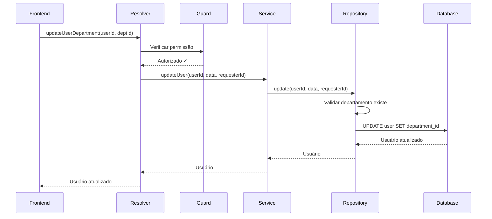

# Gerenciamento de Departamento de Usuários

## Visão Geral

Sistema de permissão administrativa que permite desenvolvedores e administradores gerenciarem a atribuição de departamentos dos usuários. Esta funcionalidade complementa o sistema de permissões existente, fornecendo controle granular sobre a estrutura organizacional.

## Arquitetura da Solução

### 1. Permissão no Schema

**Localização:** `prisma/schema.prisma`

```prisma
enum PermissionResolverName {
  // ... outras permissões
  updateUserDepartment  // Permite admin/dev atualizar department_id de qualquer usuário
  // ... outras permissões
}
```

**Migration:** `20260120041709_add_update_user_department_permission`

### 2. Seed de Permissões

**Localização:** `src/scripts/seed-permissions.ts`

```typescript
const permissionsDisabledToClient = [
  // ... outras permissões
  { 
    name: 'update user department', 
    description: 'Update or remove user department assignment (admin/developer only)', 
    resolver_name: 'updateUserDepartment' as PermissionResolverName, 
    group: 'USER' as PermissionGroup, 
    key_code: 'USER_DEPARTMENT_UPDATE', 
    disabled_to_client: true 
  },
  // ... outras permissões
];
```

**Características:**
- `key_code: 'USER_DEPARTMENT_UPDATE'` - Código único da permissão
- `disabled_to_client: true` - Permissão fixa, exclusiva para desenvolvedores e administradores
- `group: 'USER'` - Grupo de permissões relacionadas a usuários
- Permite atualizar e remover department_id de qualquer usuário

### 3. Mutation no Resolver

**Localização:** `src/graphql/user.resolver.ts`

```typescript
@Permission()
@Mutation(() => UserModel)
async updateUserDepartment(
  @Args('userId') userId: string,
  @Args('departmentId', { nullable: true }) departmentId: string | null,
  @Context() context: { userId: string },
): Promise<Omit<User, 'password'>> {
  const requester_id = context.userId;
  return await this.userService.updateUser(
    userId, 
    { department_id: departmentId || undefined }, 
    requester_id
  );
}
```

**Parâmetros:**
- `userId` (obrigatório): ID do usuário cujo departamento será atualizado
- `departmentId` (opcional): ID do novo departamento ou null para remover
- Context: Injeta automaticamente o `userId` do requisitante para auditoria

**Retorno:**
- Objeto User atualizado (sem o campo password)

### 4. Lógica no Repository

**Localização:** `src/repositories/user.repository.ts`

O repository já está preparado para lidar com remoção de departamento:

```typescript
...(department_id !== undefined && {
  department: department_id === ''
    ? { disconnect: true }  // Remove departamento
    : { connect: { id: department_id } }  // Atribui departamento
}),
```

**Comportamento:**
- `departmentId = null` ou string vazia: Remove a associação com departamento
- `departmentId = "uuid"`: Conecta o usuário ao departamento especificado
- Validação automática: Verifica se o departamento existe antes de conectar
- Auditoria completa: Registra quem fez a mudança (`updated_by`) e quando (`updated_at`)

### 5. Estrutura do Prisma Schema

**Model User:**

```prisma
model User {
  id                        String                   @id @default(uuid())
  name                      String
  email                     String                   @unique
  // ... outros campos
  department_id             String?                  // Campo opcional
  department                Department?               @relation(fields: [department_id], references: [id])
  // ... outros campos
}
```

**Características:**
- ✅ Campo `department_id` é opcional (String?)
- ✅ Relação com modelo Department
- ✅ Permite null (usuário sem departamento)

## API GraphQL

### Mutation

```graphql
mutation UpdateUserDepartment($userId: String!, $departmentId: String) {
  updateUserDepartment(userId: $userId, departmentId: $departmentId) {
    id
    name
    email
    department_id
    department {
      id
      name
    }
  }
}
```

### Exemplos de Uso

#### 1. Atribuir um departamento a um usuário

```graphql
mutation {
  updateUserDepartment(
    userId: "550e8400-e29b-41d4-a716-446655440000"
    departmentId: "660e8400-e29b-41d4-a716-446655440001"
  ) {
    id
    name
    email
    department_id
  }
}
```

**Resposta:**
```json
{
  "data": {
    "updateUserDepartment": {
      "id": "550e8400-e29b-41d4-a716-446655440000",
      "name": "João Silva",
      "email": "joao.silva@example.com",
      "department_id": "660e8400-e29b-41d4-a716-446655440001"
    }
  }
}
```

#### 2. Remover departamento de um usuário

```graphql
mutation {
  updateUserDepartment(
    userId: "550e8400-e29b-41d4-a716-446655440000"
    departmentId: null
  ) {
    id
    name
    email
    department_id
  }
}
```

**Resposta:**
```json
{
  "data": {
    "updateUserDepartment": {
      "id": "550e8400-e29b-41d4-a716-446655440000",
      "name": "João Silva",
      "email": "joao.silva@example.com",
      "department_id": null
    }
  }
}
```

#### 3. Transferir usuário entre departamentos

```graphql
# Primeiro: Usuário está no Departamento A
mutation {
  updateUserDepartment(
    userId: "550e8400-e29b-41d4-a716-446655440000"
    departmentId: "dept-a-uuid"
  ) {
    id
    department_id
  }
}

# Depois: Transferir para Departamento B
mutation {
  updateUserDepartment(
    userId: "550e8400-e29b-41d4-a716-446655440000"
    departmentId: "dept-b-uuid"
  ) {
    id
    department_id
  }
}
```

## Controle de Acesso

### Permissões Necessárias

Esta permissão deve ser atribuída **apenas** aos seguintes roles:

| Role | Acesso | Justificativa |
|------|--------|---------------|
| Developer | ✅ Sim | Controle total do sistema |
| Admin | ✅ Sim | Gestão organizacional |
| Institutional Department Leader | ✅ Sim | Gerencia usuários do departamento institucional |
| Church Department Leader | ✅ Sim | Gerencia usuários do departamento da igreja |
| Usuário Comum | ❌ Não | Restrição de segurança |
| Manager | ❌ Não | Apenas para casos específicos |

### Proteção

```typescript
@Permission()  // Decorator obrigatório
@Mutation(() => UserModel)
async updateUserDepartment(...) { ... }
```

O decorator `@Permission()` em conjunto com `PermissionsGuard` garante que:
- ✅ Apenas usuários com a permissão `updateUserDepartment` podem executar
- ✅ Token JWT válido é obrigatório
- ✅ Permissão é verificada antes da execução

## Implementação Frontend

### React com Apollo Client

```typescript
import { useMutation } from '@apollo/client';
import { gql } from '@apollo/client';
import { toast } from 'react-toastify';

const UPDATE_USER_DEPARTMENT = gql`
  mutation UpdateUserDepartment($userId: String!, $departmentId: String) {
    updateUserDepartment(userId: $userId, departmentId: $departmentId) {
      id
      name
      email
      department_id
      department {
        id
        name
      }
    }
  }
`;

interface UserDepartmentManagerProps {
  userId: string;
}

function UserDepartmentManager({ userId }: UserDepartmentManagerProps) {
  const [updateDepartment, { loading }] = useMutation(UPDATE_USER_DEPARTMENT, {
    onCompleted: () => {
      toast.success('Departamento atualizado com sucesso!');
    },
    onError: (error) => {
      toast.error(`Erro: ${error.message}`);
    },
  });

  const assignDepartment = async (departmentId: string) => {
    await updateDepartment({
      variables: { userId, departmentId }
    });
  };

  const removeDepartment = async () => {
    await updateDepartment({
      variables: { userId, departmentId: null }
    });
  };

  return (
    <div className="department-manager">
      <h3>Gerenciar Departamento</h3>
      
      {/* Select de departamentos */}
      <select onChange={(e) => assignDepartment(e.target.value)}>
        <option value="">Selecione um departamento</option>
        <option value="dept-1">Departamento A</option>
        <option value="dept-2">Departamento B</option>
      </select>
      
      {/* Botão para remover */}
      <button 
        onClick={removeDepartment}
        disabled={loading}
      >
        Remover Departamento
      </button>
    </div>
  );
}

export default UserDepartmentManager;
```

### TypeScript Types

```typescript
interface User {
  id: string;
  name: string;
  email: string;
  department_id: string | null;
  department?: Department | null;
}

interface Department {
  id: string;
  name: string;
}

interface UpdateUserDepartmentVariables {
  userId: string;
  departmentId: string | null;
}

interface UpdateUserDepartmentData {
  updateUserDepartment: User;
}
```

## Casos de Uso

### 1. Transferência de Departamento

**Cenário:** Admin precisa transferir usuário do Departamento Financeiro para Departamento RH

```typescript
const transferUser = async () => {
  await updateDepartment({
    variables: {
      userId: "user-id-123",
      departmentId: "rh-dept-id"
    }
  });
};
```

**Fluxo:**
1. Sistema valida se departamento RH existe
2. Atualiza relacionamento no banco
3. Registra auditoria (quem e quando)
4. Retorna usuário atualizado

### 2. Remoção de Vínculo Departamental

**Cenário:** Usuário temporário ou consultor não deve estar vinculado a departamento

```typescript
const removeLink = async () => {
  await updateDepartment({
    variables: {
      userId: "consultant-id",
      departmentId: null
    }
  });
};
```

**Resultado:**
- `department_id` = null
- Relacionamento desconectado
- Usuário fica "sem departamento"

### 3. Primeira Atribuição

**Cenário:** Novo usuário criado sem departamento, admin atribui posteriormente

```typescript
// 1. Usuário criado via signup
const newUser = await createUser({
  name: "Maria Santos",
  email: "maria@example.com",
  // department_id não especificado
});

// 2. Admin atribui departamento
await updateDepartment({
  variables: {
    userId: newUser.id,
    departmentId: "sales-dept-id"
  }
});
```

### 4. Reorganização em Massa

**Cenário:** Reestruturação organizacional, múltiplos usuários mudam de departamento

```typescript
const bulkTransfer = async (userIds: string[], newDeptId: string) => {
  for (const userId of userIds) {
    await updateDepartment({
      variables: { userId, departmentId: newDeptId }
    });
  }
};

// Uso
await bulkTransfer(
  ["user-1", "user-2", "user-3"],
  "new-department-id"
);
```

## Segurança e Validações

### Validações Implementadas

| Validação | Local | Descrição |
|-----------|-------|-----------|
| Permissão obrigatória | PermissionsGuard | Verifica se usuário tem `updateUserDepartment` |
| Existência de departamento | UserRepository | Valida se departmentId existe antes de conectar |
| Auditoria completa | UserRepository | Registra `updated_by` e `updated_at` |
| Token JWT válido | AuthGuard | Garante autenticação válida |

### Tratamento de Erros

```typescript
// No repository
if (department_id) {
  await this.departmentRepository.findById(department_id);
  // Se não encontrar, lança erro
}

// Possíveis erros:
// - Department not found
// - User not found
// - Unauthorized (sem permissão)
// - Invalid token
```

### Auditoria

Todas as operações são auditadas:

```typescript
{
  updated_by: requester_id,  // ID do admin que fez a mudança
  updated_at: new Date(),    // Timestamp da mudança
}
```

**Rastreamento completo:**
- Quem fez a mudança (admin/developer)
- Quando foi feita
- Qual usuário foi afetado
- De qual departamento para qual (via logs)

## Fluxo de Dados Completo



## Considerações Finais

### ✅ Vantagens

- **Controle centralizado:** Admins e líderes departamentais podem gerenciar departamentos
- **Gestão hierárquica:** Líderes de departamento podem gerenciar seus próprios usuários
- **Flexibilidade:** Permite atribuição e remoção de departamentos
- **Auditoria completa:** Todas as mudanças são rastreadas
- **Segurança:** Permissão fixa, não pode ser removida pelo cliente
- **Validação robusta:** Garante integridade dos dados

### ⚠️ Considerações

1. **Performance em massa:** Para muitas atualizações simultâneas, considerar batch operations
2. **Notificações:** Considerar notificar usuário quando seu departamento é alterado
3. **Histórico:** Implementar tabela de histórico de mudanças de departamento se necessário
4. **Permissões granulares:** Futuramente, permitir que managers gerenciem apenas seus departamentos

### 📋 Próximos Passos

- [ ] Implementar histórico de mudanças de departamento
- [ ] Adicionar notificações por email quando departamento é alterado
- [ ] Criar relatório de usuários sem departamento
- [ ] Permitir transferência em massa via CSV
- [ ] Adicionar filtros e busca por departamento no frontend

## Conclusão

A implementação da permissão `updateUserDepartment` fornece aos administradores, desenvolvedores e líderes departamentais controle sobre a estrutura organizacional, permitindo gerenciar atribuições de departamento de forma segura, auditada e eficiente. 

**Roles com acesso:**
- ✅ **Developer** - Controle total do sistema
- ✅ **Admin** - Gestão organizacional completa
- ✅ **Institutional Department Leader** - Gerencia usuários do seu departamento institucional
- ✅ **Church Department Leader** - Gerencia usuários do seu departamento da igreja

O sistema garante integridade dos dados, validações robustas e rastreamento completo de todas as operações, permitindo uma gestão hierárquica eficiente dos recursos humanos da organização.
